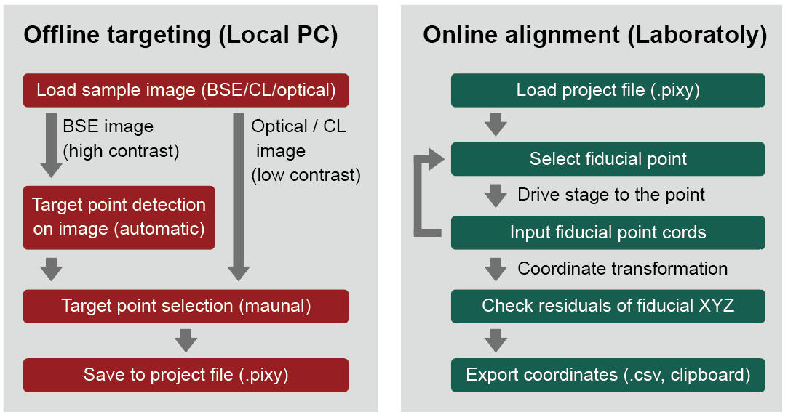

# PiXY — Pixel to Stage-XY Coordinate Converter


PiXY is an open-source graphical user interface (GUI) software for **offline targeting in microanalysis**. It allows measurement positions to be selected on pre-acquired sample images before sample loading and subsequently converted into instrument stage coordinates during online alignment.

PiXY is designed to reduce the time and operator effort required for **on-instrument targeting**, particularly when a large number of measurement positions must be selected, such as in zircon U–Pb dating and other microanalytical applications.

## Visual Overview

PiXY provides an offline targeting environment in which target points can be selected and reviewed on pre-acquired sample images.


## Overview

PiXY uses a **two-step workflow**:



**Offline targeting**  
Target points are selected on pre-acquired sample images before the sample is loaded onto the analytical instrument.

**Online alignment**  
After sample loading, fiducial points are used to establish the relationship between image coordinates and instrument stage coordinates. The transformation is then applied to all target points selected during offline targeting.

This workflow allows a large number of measurement positions to be prepared in advance and brings the instrument stage to the vicinity of the selected targets before measurement.

## Key Features

### Offline targeting
Measurement positions can be prepared on sample images before sample loading. Target points selected by different methods can be combined within the same project.

### Manual targeting
Arbitrary target positions can be specified directly on an image. This is useful when measurement positions are defined by textures or spatial relationships, including:
- mineral or phase boundaries
- zoning
- reaction rims
- inclusions
- textural features that are difficult to separate by image segmentation

### Image-based target extraction
For particulate samples with suitable image contrast, PiXY can automatically extract particle regions using colour segmentation and connected-component analysis.

Extracted particle regions can be used to generate:
- **core target points** based on particle centroids
- **rim target points** positioned inside particle boundaries

This approach is particularly useful when many particles of the same type need to be targeted, such as detrital zircon grains.

### Fiducial-based coordinate transformation
During online alignment, PiXY uses fiducial points for which both image coordinates and corresponding instrument stage coordinates are known.


For the XY plane, image coordinates are transformed using a **2D similarity transformation** (isotropic scaling, rotation, and translation). The Z coordinate is estimated independently by **plane fitting** to the sample surface.

Transformation residuals can be inspected to assess the accuracy of the coordinate transformation.

### Coordinate export
The calculated stage coordinates can be reviewed in the coordinate table and:
- exported as CSV files
- copied to the clipboard as text data

This allows coordinates to be transferred to analytical instruments or control software that accept text-based coordinate data.

## Project Files

PiXY stores the sample image, targeting settings, and selected target-point coordinates together in a `.pixy` project file.

Keeping the image information and targeting data together improves traceability and allows targeting work to be saved and continued later.

## Supported Image Formats

PiXY supports the following image formats:
- TIFF: `.tif`, `.tiff`
- JPEG: `.jpg`, `.jpeg`
- PNG: `.png`
- BMP: `.bmp`

## Getting Started

### Windows
A standalone Windows executable is provided, so Python does not need to be installed when using the pre-built application.

Download the latest release and run:
```
PiXY_ver152.exe
```

The recommended screen resolution is **1200 × 900 pixels or larger**.

### From Source
To run PiXY from source, Python 3.8 or later is recommended.

Clone the repository:
```bash
git clone https://github.com/YoshiakiKON/PiXY.git
cd PiXY
```

Create and activate a virtual environment:
```bash
python -m venv .venv
```

On Windows PowerShell:
```powershell
.\.venv\Scripts\Activate.ps1
```

Install the required packages:
```bash
pip install -r requirements.txt
```

Run PiXY:
```bash
python Main.py
```

## Basic Workflow

A typical PiXY workflow is:

1. **Open a pre-acquired sample image.**
2. **Select target points** manually or extract them automatically from suitable particle images.
3. **Save the project** containing the image and target-point information.
4. **Load the sample onto the analytical instrument.**
5. **Identify fiducial points** and enter their corresponding stage coordinates.
6. **Estimate the image-to-stage coordinate transformation.**
7. **Inspect transformation residuals** and, if necessary, adjust the fiducial points.
8. **Calculate stage coordinates** for all target points.
9. **Export or copy the coordinates** for use with the analytical instrument or its control software.

For detailed instructions and screenshots, see the manuals below.

## Documentation

### Manuals

- **English:** `InstructionManual_EN_v1.5.3.md`
- **日本語:** `InstructionManual_JP_v1.5.3.md`

The manuals describe the complete offline-targeting and online-alignment workflow, including image-based target extraction, manual target selection, fiducial-point registration, coordinate transformation, and coordinate export.

### Release Notes

Changes specific to each software version are documented separately:
- `RELEASE_NOTES_v1.5.3.md`

## Citation

If you use PiXY in published research, please cite the software and the associated publication.

The recommended software citation is provided in `CITATION.cff`.

**Zenodo DOI:** 10.5281/zenodo.18174474

## Source Code and Development

PiXY is distributed as open-source software under the MIT License.

The main components include:
- `Ui.py` — graphical user interface
- `CalcCentroid.py` — particle segmentation and centroid extraction
- `rendering.py` — image and graphical rendering
- `Util.py` — utility functions

Issues and pull requests are welcome. For substantial changes, please open an issue first to discuss the proposed design.

## Version

**Current release: v1.5.3**

## License

PiXY is released under the **MIT License**. See `LICENSE` for details.

## Contact

**Yoshiaki KON**  
Geological Survey of Japan (GSJ), AIST  
Japan
