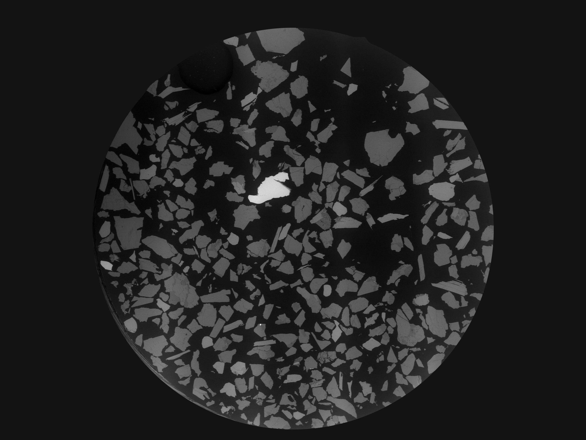

# PiXY — Quick Start (one-page)

This quick manual shows the minimal steps to use PiXY for image-to-stage coordinate mapping.

## 1. Launch
- Run the standalone Windows executable `PiXY_ver142.exe` (or run `py Main.py` for Python).

## 2. Open an image
- Click `Open Image` and select a BSE/optical image (example below).

## 3. Add fiducial points
1. Click `Add Fiducial Point` to enter fiducial-point mode.
2. Click a characteristic point on the image (e.g., particle tip, scratch) and enter the corresponding stage `X, Y, Z` coordinates in the table.
3. Repeat for at least 3 non-collinear points (we used ~120° spacing around sample).

## 4. Run automatic detection
- Adjust detection parameters ("Number of Groups", area thresholds) and run detection.
- Detected centroids are shown as overlays. Use the preview mode to fine-tune parameters.

## 5. Export / Transfer
- Export detected coordinates as CSV or copy to clipboard for direct import to instrument software.
- For laser-ablation stage targeting, export stage coordinates (X,Y,Z) and load into the instrument.

## Tips
- Use clear, reproducible fiducial points (artificial markers are optional, but not required).
- For large images, use the preview (smaller scale) to speed up parameter tuning, then run full-resolution detection.

## Licensing & Where to get help
- License: MIT (see `LICENSE`).
- Releases and prebuilt executables: GitHub Releases (see repository).
- For official v1.4.2 procedures, use:
	- `InstructionManual_EN_v1.4.2.md` / `InstructionManual_JP_v1.4.2.md`
	- `documentation/QuickManual_EN_v1.4.2.md` / `documentation/QuickManual_JP_v1.4.2.md`

---

If you want different images or wording, tell me which screenshots to use or supply alternative images.
