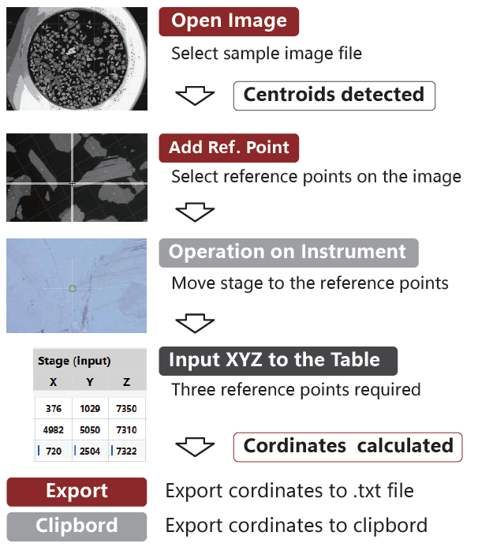

# PiXY v1.2.1 — Release Notes (2026-02-03)

## Overview

PiXY is a desktop GUI tool for image-based centroid extraction and pixel→stage coordinate conversion.

Typical use cases:
- Detect particle/grain-like regions in microscope/SEM images and extract their centroids.
- Convert centroid pixel coordinates to stage coordinates using user-defined fiducial points.
- Export results for downstream measurement workflows (e.g., stage navigation, automated acquisition).

**Recommended screen size**: 1200×900 or larger (the UI is more comfortable at this size).



## What’s Included

- Standalone Windows executable: `PiXY_ver121.exe`
- Source code (Python)
- Documentation and submission materials (JOSS draft, citation metadata)

## Installation & Quick Start

### Option A: Standalone Windows executable
1. Download `PiXY_ver121.exe`.
2. Run it (no installer).
3. Open an image via **Open Image**.
4. (Optional but recommended) Add fiducial points via **Add Fiducial Point** (≥3 non-collinear points) to enable pixel→stage conversion.
5. Adjust detection parameters (e.g., number of groups, area thresholds) and run grain identification.
6. Export results (CSV / clipboard as supported by the UI).

### Option B: Run from source (Windows PowerShell)
```powershell
cd C:\Python\Px2XY
python -m venv .venv
.\.venv\Scripts\Activate.ps1
pip install -r requirements.txt
python Main.py
```

## What’s New in v1.2.1

This release focuses on consistency in terminology/metadata and Windows EXE polish.

### User-facing improvements
- **Terminology unified**: Replace “reference point(s)” with **“fiducial point(s)”** across the UI and documentation.
  - Note: PiXY fiducials are naturally occurring specimen features (e.g., scratches or particle tips), not pre-made fiducial markers.

### Packaging / Windows EXE improvements
- **EXE icon fixed**: The built `PiXY_ver121.exe` has the proper Windows icon (PyInstaller `--icon` using `PiXY_icon.ico`).

### Citation / DOI
- **Fixed DOI across versions**: https://doi.org/10.5281/zenodo.18174474

## Notes

- DOI is intentionally kept constant regardless of the PiXY software version.
