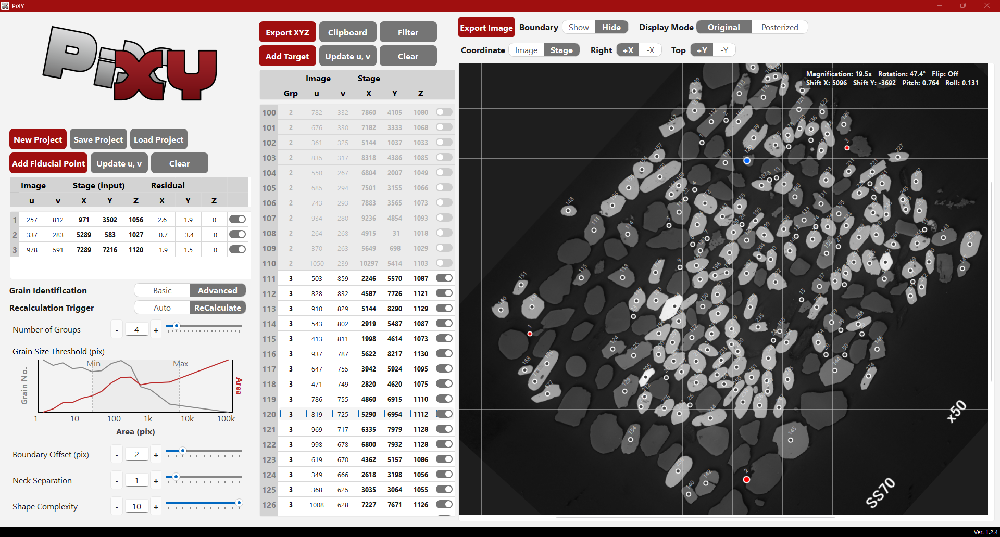

# PiXY v1.2.5 — Release Notes (2026-02-18)

## Overview

PiXY is a desktop GUI tool for image-based centroid extraction and pixel→stage coordinate conversion. This minor release focuses on documentation, submission packaging, and reproducibility improvements prepared for a SoftwareX submission.

## Screenshots

Overview:


## What’s New in v1.2.5

### Reproducibility & Metadata
- Ensured K-means clustering uses a fixed random seed for deterministic posterization results across runs.
- Added or updated metadata files: repository and archive DOI references, dependency listing, and a repository checklist for archival/release readiness.

### Packaging / Examples
- Included a minimal LaTeX skeleton and ancillary submission files (`paper_for_pandoc.md`, `submission.tex`, `data_and_repo.md`) to help reviewers reproduce results and access the code/data.

## Notes for users
- There are no functional code changes in this release compared to v1.2.3—the changes are documentation, packaging, and submission-preparation focused.
- Run the GUI as before:

```bash
python -m pip install -r requirements.txt
python Main.py
```

or use the standalone Windows executable if available in `dist/`.

## Citation and archive
- Repository: https://github.com/YoshiakiKON/PiXY
- Archive DOI: 10.5281/zenodo.18174474

## Acknowledgements
- This release packages materials prepared for a SoftwareX submission. The author acknowledges the open-source communities behind Python, OpenCV, NumPy, and PySide6.

--

If you want, I can also:
- Copy the `Graphical_abstract.png` URL and insert a short HTML/Markdown snippet suitable for the Zenodo description; or
- Update `RELEASE_NOTES_v1.2.5.md` to include more user-visible changes if you provide any code changes to list.
