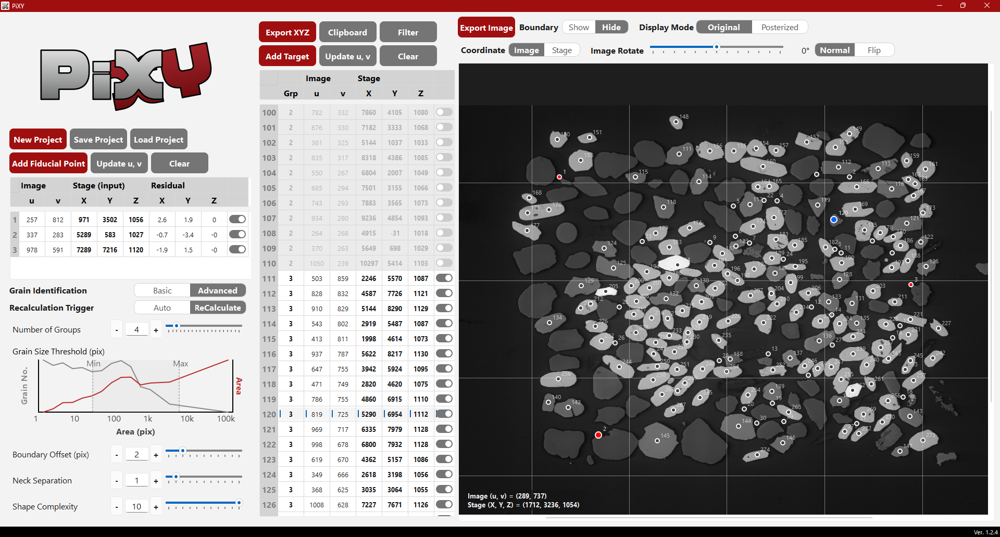

# PiXY v1.5.4

**Release date:** 2026-08-18

## Overview

PiXY (Pixel to stage-XY Coordinate Converter) is an open-source graphical user interface (GUI) software for offline targeting in microanalysis. It enables measurement positions to be selected on pre-acquired sample images before sample loading and subsequently converted into instrument stage coordinates during online alignment.

PiXY is designed to reduce the time and operator effort required for on-instrument targeting, particularly when a large number of measurement positions must be selected, such as in zircon U窶撤b dating and other microanalytical applications.

PiXY provides two complementary approaches to target-point selection:

- **Image-based extraction:** particle regions can be extracted from high-contrast images using colour segmentation and connected-component analysis. Particle centroids can be used as core target points, and additional points can be generated near particle boundaries for rim targeting.
- **Manual targeting:** arbitrary positions can be selected directly on an image, allowing targeting based on textures, zoning, inclusions, phase boundaries, or other features that cannot be reliably identified by particle segmentation.

Target points selected by either approach can be combined within the same project.

## Offline Targeting and Online Alignment

PiXY uses a two-step workflow.

In the **offline targeting** step, target points are selected on pre-acquired sample images. For particulate samples such as zircon grains in back-scattered electron images, image processing can be used to extract particle regions and generate target points automatically. Manual selection is available when image-based extraction is unsuitable or when measurement positions are defined by textural relationships.

In the **online alignment** step, PiXY converts image coordinates into instrument stage coordinates using fiducial points whose image and stage coordinates are known. The XY coordinates are transformed using a two-dimensional similarity transformation, while the Z coordinate is estimated independently by plane fitting. The resulting stage coordinates can then be transferred to the analytical instrument or its control software.

This workflow allows a large number of target positions to be prepared before sample loading and brings the instrument stage to the vicinity of the selected targets before measurement.

## Project and Data Handling

PiXY stores the sample image, targeting settings, and selected target-point coordinates together in a project file (`.pixy`). This allows targeting information to be retained and reused without repeating the offline selection process.

Converted stage coordinates can be reviewed in the coordinate table and exported as CSV files or copied to the clipboard as text data. This facilitates transfer to instruments or control software that accept coordinate information in text-based formats.

## Image Processing

For image-based target extraction, PiXY uses K-means clustering for colour segmentation followed by connected-component analysis. Users can interactively adjust parameters controlling the segmentation and extraction process, including the number of colour groups, grain-area range, boundary offset, neck separation, and shape complexity.

For each extracted particle, the centroid can be used as a core target point. A rim target point can also be generated inside the particle boundary along the direction from the centroid toward the farthest boundary point.

## Supported Image Formats

PiXY supports commonly used image formats for sample imaging:

- TIFF: `.tif`, `.tiff`
- JPEG: `.jpg`, `.jpeg`
- PNG: `.png`
- BMP: `.bmp`

## This Release

Version 1.5.4 is a maintenance release that fixes project-load calculation-mode restoration and keeps the displayed trigger label in sync with the saved Auto/Manual state.

It also stabilizes the online and offline target-table layouts so the correct column set is shown after loading projects or switching workflow stages.

## Included Files

- Standalone Windows executable: `PiXY_ver154.exe`
- Source code for running PiXY in a Python environment
- `InstructionManual_EN_v1.5.4.md`
- `InstructionManual_JP_v1.5.4.md`

**Recommended screen size:** 1200 ﾃ・900 pixels or larger.

## Citation

If you use PiXY in published research, please cite the software and the associated publication.

**DOI:** 10.5281/zenodo.18174474

See `CITATION.cff` for the recommended citation metadata.

## Platform

The pre-built executable is provided for Windows. Users can also run PiXY from the source code in a Python environment.

## Documentation

The Quick Manual provides a step-by-step description of the offline targeting and online alignment workflow, including image-based target extraction, manual target selection, fiducial-point registration, and coordinate export.

