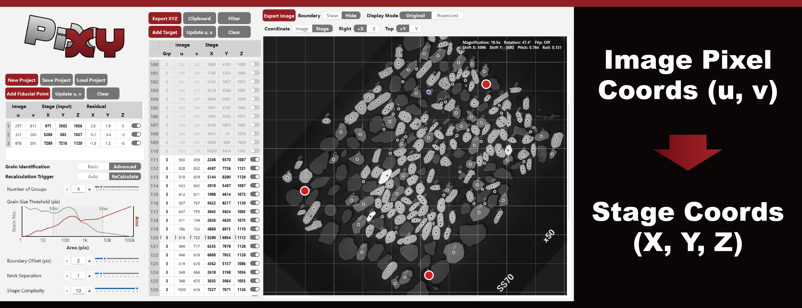

PiXY: Pixel to stage-XY Coordinate Converter
=============================================

Yoshiaki KON
Geological Survey of Japan (GSJ), National Institute of Advanced Industrial Science and Technology (AIST)

29 January 2026

Abstract

PiXY is an open-source GUI tool that converts pixel coordinates from microscopy images into instrument stage coordinates to speed micrometer-scale targeting in in-situ microanalysis. The workflow combines automatic centroid extraction from images with interactive parameter tuning, user-defined fiducials, and a least-squares affine mapping to produce instrument-ready coordinate lists. By enabling offline preparation of target coordinates, PiXY reduces on-instrument targeting time and human error without requiring dedicated fiducial markers.

{width=100%}

Keywords: microscopy targeting; image registration; centroid extraction; fiducial-based transform; offline targeting; open-source software

Highlights

- Reduce on-instrument targeting time by enabling offline coordinate preparation.
- Open-source GUI that converts image pixel positions to instrument stage coordinates.
- Automatic centroid extraction with interactive parameter tuning and export.
- Residual inspection using multiple fiducials improves targeting robustness.

1. Motivation and significance

Microanalysis instruments such as LA-ICP-MS, SIMS, EPMA, and SEM-EDS require micrometer-scale selection of analysis positions on solid sample surfaces. A common workflow is to image a sample in advance using optical or electron microscopy and then mount the same sample on an analytical instrument. On the instrument, operators adjust an XYZ stage while viewing the instrument’s observation image to decide measurement locations. In practice, this “positioning/targeting” step can take longer than the measurement per spot. Because the required time depends on operator experience, targeting frequently becomes a major bottleneck for instrument time.

(To keep submission concise, full Methods, parameter lists and detailed validation are in the repository documentation and supplementary files.)

2. Software description

PiXY links two steps in a single GUI workflow: (1) offline targeting on pre-acquired images, where targets are selected and particle centroids are extracted, and (2) fiducial-based coordinate transformation from image coordinates to analytical-instrument stage coordinates, followed by instrument-ready export.

3. Validation

Validation on real specimens (N=100, five fiducials) shows practical targeting accuracy: 50% of residuals were within ~3 μm (X), 3 μm (Y), 4 μm (Z), and 90% were within ~10–21 μm across axes.

4. Impact and Conclusions

PiXY integrates centroid extraction, fiducial-based least-squares coordinate conversion, residual inspection, and batch export into a single GUI workflow for offline targeting. Validation with real specimens shows that residual distributions improve when using more fiducials, supporting practical use for instrument-ready coordinate preparation.

Acknowledgements

This work was supported by JSPS KAKENHI (Grant Number: 25H00682). The author acknowledges the open-source communities behind Python, OpenCV, NumPy, and PySide6.

Declaration of generative AI and AI-assisted technologies in the manuscript preparation process

During the preparation of this work the author used GitHub Copilot, Google Gemini, xAI Grok, and Anthropic Claude to assist with drafting and programming tasks. The author reviewed, edited, and validated all AI-generated content and takes full responsibility for the final manuscript.

Data and software availability

The source code is available at https://github.com/YoshiakiKON/PiXY and archived at Zenodo (DOI: 10.5281/zenodo.18174474). Detailed parameters and validation data are available in the `documentation/` directory.

References

(See `paper.bib` for BibTeX entries.)
