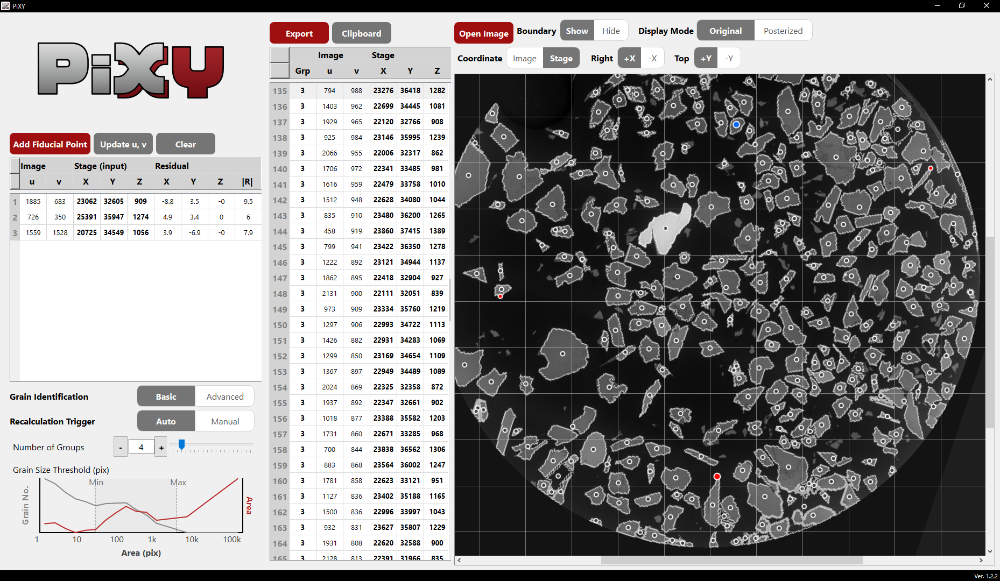
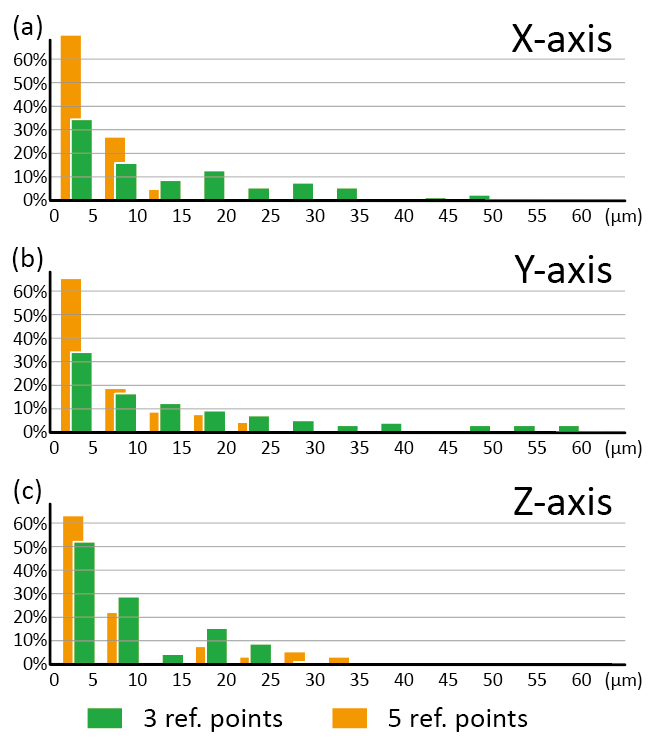

Abstract

PiXY is open-source software that links target selection on microscopy images with physical positioning on an analytical instrument stage, reducing time in microanalysis workflows in geoscience and materials science. PiXY extracts particle image coordinates $(u,v)$ by combining K-means clustering and connected-component analysis, then estimates an affine mapping from user-defined fiducial points (least squares) to convert image coordinates into physical stage coordinates $(X,Y,Z)$. Validation on real specimens (N = 100, five fiducial points) shows tightly concentrated residuals: 50% within 3 μm (X), 3 μm (Y), and 4 μm (Z), and 90% within 10 μm (X), 16 μm (Y), and 21 μm (Z). The practical significance of PiXY is that it reduces operator-dependent targeting workload in in-situ microanalysis, improves instrument utilization by shortening non-measurement stage operations, and supports reproducible spot selection without requiring dedicated fiducial markers or proprietary workflows.

PiXY facilitates offline targeting by allowing users to pre-select targets on pre-acquired images and prepare instrument-ready stage coordinates before instrument time, thereby reducing machine time spent on manual relocation.

Metadata

| Field | Value |
|---|---|
| Software title | PiXY: Pixel to stage-XY Coordinate Converter |
| Authors | Yoshiaki KON |
| Version | 1.2.4 |
| Repository URL | https://github.com/YoshiakiKON/PiXY |
| Archive DOI | 10.5281/zenodo.18174474 |
| License | MIT |
| Language | Python 3.8+ |
| Dependencies | PySide6, OpenCV, NumPy, PyInstaller |
| Release date | 15 February 2026 |

1. Introduction

Microanalysis instruments such as LA-ICP-MS, SEM-EDS, EPMA, and SIMS require reliable micrometer-scale targeting on solid sample surfaces. A common workflow is to image a sample in advance and then mount the same sample on an analytical instrument, where an operator adjusts an XYZ stage while viewing the instrument’s observation image.

In applications such as zircon U–Pb geochronology, targets are selected on pre-acquired microscope images and then relocated on the analytical instrument for spot-by-spot measurement [@Iizuka:2006]. In practice, this “relocation/targeting” step can take longer than the measurement per spot and is strongly operator-dependent, making it a frequent bottleneck for instrument time.

Targeting on the analytical instrument is often the operational bottleneck. PiXY aims to semi-automate conversion from microscopy image coordinates to physical stage coordinates and provide instrument-ready outputs (CSV/clipboard), reducing targeting time and operator variability. In other words, PiXY shifts part of the targeting workload to offline targeting (pre-selection and coordinate preparation prior to instrument time).

General-purpose image-analysis tools (e.g., ImageJ/FIJI, OpenCV) perform particle detection, and fiducial-based registration methods align images to stage coordinates [@sheriff2020autocrim]. PiXY integrates detection, fiducial registration, residual inspection, and export in one GUI.


2. Software Description

PiXY supports offline targeting in microanalysis by linking two steps in a single GUI workflow: (i) target selection and centroid extraction on pre-acquired images, and (ii) fiducial-based coordinate transformation and export of instrument-ready stage coordinates.

2.1 Offline targeting: centroid extraction (particle detection)

For centroid extraction, PiXY prioritizes portability and fast, interactive iteration in routine laboratory workflows. To keep the GUI responsive on large images, centroid computation is performed on a resized “processing image” (by default, the full image is downscaled to a target width of 640 px when needed) and coordinates are then mapped back to full-image pixel coordinates for export. PiXY applies OpenCV K-means posterization (with a fixed random seed for determinism) to reduce the image to $K$ representative colors [@macqueen1967], then builds binary masks for each color and extracts connected components (4-connectivity). Components can be interactively filtered by minimum and maximum area (including histogram-based selection), and an optional trim parameter applies morphological erosion to suppress boundary artifacts. For images where particles are touching, PiXY also provides an optional “neck separation” setting that attempts to split pinched components using erosion-derived cores and marker propagation before centroid calculation.

2.2 Fiducial-based coordinate transformation and export

For coordinate conversion, PiXY uses a 2D→3D affine model so that parameters can be estimated stably from a small number of fiducial pairs (three or more), rather than requiring more complex non-linear calibration. PiXY does not require dedicated fiducial markers: any distinctive, repeatably identifiable feature on the sample surface (e.g., particle tips, scratches, edges) can be used as a fiducial, as long as it can be found both on the pre-acquired image and on the instrument’s observation image.

PiXY models the mapping with a 2D→3D affine transform:

$$
\begin{pmatrix}
X\\
Y\\
Z
\end{pmatrix}
=
\begin{pmatrix}
a_{11} & a_{12} & t_x\\
a_{21} & a_{22} & t_y\\
a_{31} & a_{32} & t_z
\end{pmatrix}
\begin{pmatrix}
x_{full}\\
y_{full}\\
1
\end{pmatrix}.
$$

Parameters are estimated by least squares from multiple fiducial pairs $(x_i,y_i)\rightarrow(X_i,Y_i,Z_i)$. Because fiducial entry on the instrument can be time-consuming, PiXY includes manual rotation/flip controls to help users match image orientation during fiducial identification, and it supports residual inspection before exporting instrument-ready coordinates (e.g., via CSV and clipboard).

The GUI is implemented with PySide6. Code modules include `Ui.py` (GUI), `CalcCentroid.py` (centroid extraction), `Util.py` (helpers and transformations), `rendering.py` (overlays), and `Main.py` (entry point). PiXY is distributed both as Python source and as a standalone Windows executable.

See Figure 1 for the GUI.



Installation and availability

Install dependencies, or run the provided Windows executable. Minimal example:

```bash
python -m pip install -r requirements.txt
python Main.py
```

3. Illustrative examples

3.1 Example workflow (offline targeting)

1. Acquire a microscope image of the sample and decide candidate targets on the image.
2. Load the image in PiXY and tune K and area thresholds to extract centroids $(u,v)$.
3. Select a small set of fiducials on distinctive sample features in the image.
4. On the analytical instrument, relocate the same fiducials and enter the measured stage coordinates $(X,Y,Z)$.
5. Inspect residuals in the GUI; if needed, revise fiducials (or increase their number) and recompute.
6. Export instrument-ready stage coordinates (CSV/clipboard) and use them for targeting.

3.2 Example: using externally pre-processed images

If particle/background separation is challenging for a given modality, users can segment or binarize images in external tools (including ML-based workflows), then load the resulting pre-processed image into PiXY and proceed with fiducials, residual inspection, and coordinate export.

4. Validation of coordinate transformation

Validation used BSE images from JEOL JSM-6610LV and a laser‑ablation system (Raijin; Seishin Shoji). A representative dataset was acquired at 15× magnification (1560×1920 pixels; 3.33 μm/pixel) from a polished epoxy mount, and stage coordinates were recorded on the analytical instrument while visually relocating the same fiducials using the instrument’s built-in observation microscope (10× objective) and motorized XYZ stage. For each fiducial, the XY position was read when the feature was centered in the instrument view, and the Z coordinate was recorded after adjustment using the instrument’s autofocus (or equivalent focus-setting) function.

In this validation, fiducials were selected from distinctive features near the mount rim so that they spanned the field of view and constrained the transform; two configurations were compared (three fiducials approximately 120° apart, and five fiducials approximately 70° apart around the rim).
Residual histograms for three- vs five-point fiducial configurations are shown in Figure 2; with five fiducials (N=100) 50% of residuals are within 3 μm (X), 3 μm (Y), 4 μm (Z), and 90% within 10 μm (X), 16 μm (Y), and 21 μm (Z). As expected, using more fiducials generally reduces both bias and variability in the least-squares estimate.



5. Impact

PiXY streamlines targeting for in-situ micro-scale analyses in geoscience and materials science, contributing to reduced instrument run-time and improved laboratory throughput.
The accuracy of particle recognition used for centroid extraction depends on image simplicity and contrast. Therefore, PiXY is designed to accept externally pre-processed images (e.g., segmentation or binarization).
Future work includes incorporating segmentation modules and integrating PiXY with analytical-instrument control APIs to enable tighter automation.

6. Conclusions

PiXY combines established image-processing and affine-registration methods into a practical workflow for offline targeting in in-situ microanalysis. By reducing manual relocation effort during instrument time and providing instrument-ready coordinate outputs, PiXY improves reproducibility and instrument utilization.

CRediT author statement

Yoshiaki KON: Conceptualization, Data curation, Formal analysis, Funding acquisition, Investigation, Methodology, Project administration, Resources, Software, Supervision, Validation, Visualization, Writing – original draft, Writing – review and editing.

Declaration of competing interest

The author declares that there are no known competing financial interests or personal relationships that could have appeared to influence the work reported in this paper.

Acknowledgements

This work was supported by JSPS KAKENHI (Grant Number: 25H00682). The author acknowledges the open-source communities behind Python, OpenCV, NumPy, and PySide6.

During development, the author used AI-assisted tools (GitHub Copilot, Google Gemini, xAI Grok, Anthropic Claude) for drafting and programming support; all generated outputs were reviewed and validated by the author, who takes full responsibility for the final content.

References

[See `paper.bib` for BibTeX entries; citations in-text use pandoc syntax and will be numbered on conversion.]
